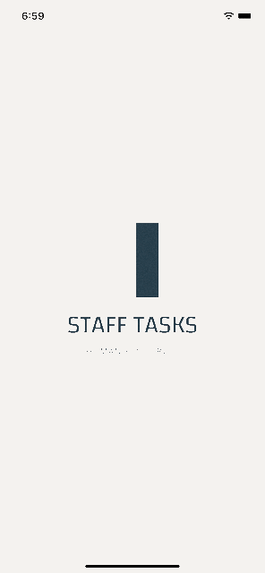
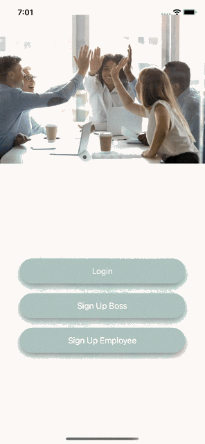

# Final_iOS_Bootcamp_Project-StaffTasks-Bushra_Oudah
An app used by managers and employees to track their tasks and other adminstrative work like holliday reservations.

## Target Users - Managers
Managers and employees

## User stories - Managers
   - Add tasks to employees and evaluate their performance.
   - Upload the payroll of employees
   - Supervise the employees calendar and accept or reject propposed vacations.
   - Do certificates of thanks.
   - Change state of employee from active to inactive
   - Delete employee from the database

## User strories - Employees
   - See a list of tasks they are required to perform and also see the managers assessment of them.
   - Consult and dowload monthly payroll.
   - Add holiday days to a calendar.
   - See and download certificate of thanks. 

## User stories - Managers & Employees
   - Register and authenticate
   - Update profile
   - Videoconference with Zoom embeded in the app.
   - Change language (Arabic - English)

## Demo

